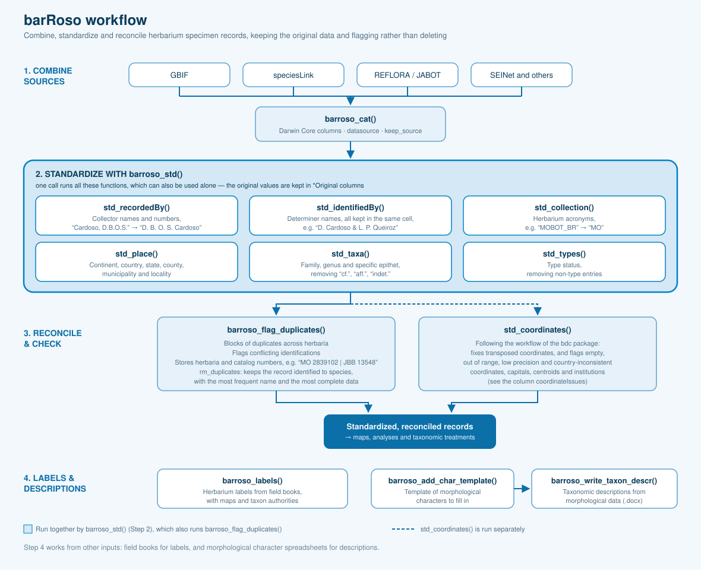

<!-- README.md is generated from README.Rmd. Please edit that file -->

# barRoso 

<!-- badges: start -->

[](https://app.codecov.io/gh/DBOSlab/barRoso)
[](https://github.com/DBOSlab/barRoso/actions/workflows/test-coverage.yaml)
[](https://github.com/DBOSlab/barRoso/actions/workflows/R-CMD-check.yaml)
[](LICENSE)
<!-- badges: end -->

**B**iodiversity **A**nalysis and **R**ecord **R**econciliation for
**O**rganizing **S**pecimen **O**bservations

## Overview

`barRoso` is an R package to combine, clean, standardize and reconcile
herbarium specimen records from public biodiversity databases such as
[GBIF](https://www.gbif.org), [speciesLink](https://specieslink.net),
the [REFLORA Virtual
Herbarium](https://floradobrasil.jbrj.gov.br/reflora/herbarioVirtual/),
the [JABOT](https://jabot.jbrj.gov.br/v3/consulta.php) collections of
the Rio de Janeiro Botanical Garden, and
[SEINet](https://swbiodiversity.org/seinet/). It is named in honor of
the Brazilian botanist [Graziela Maciel
Barroso](https://www.gov.br/jbrj/pt-br/assuntos/colecoes/arquivistica/graziela-maciel-barroso),
and the capital **R** in its name is a nod to the R ecosystem in which
it is developed.

The same collection is often distributed to several herbaria, and each
database writes it differently: `"Cardoso, D.B.O.S."` in one,
`"D. Cardoso"` in another, sometimes with a different identification or
without coordinates. By standardizing collector names and numbers,
herbarium acronyms, geographic and taxonomic fields, `barRoso` makes
these duplicates comparable, so they can be found across herbaria, and
their conflicting identifications and missing information can be
revealed.

Instead of static dictionaries, `barRoso` uses an extensive set of
regular expressions tested on real datasets, which generalizes across
sources and spelling variations. It also generates herbarium labels from
field books and taxonomic descriptions from morphological data.

### Data preservation philosophy

While many data tools prioritize aggressive cleaning, often at the cost
of discarding valuable records, `barRoso` centers on **standardization
rather than removal**. All herbarium specimens carry potential
scientific value, even when incomplete or inconsistently entered. So,
`barRoso` keeps the original values next to the standardized ones, and
**flags rather than erases** problems — conflicting identifications
among duplicates, or coordinates falling outside the informed country —
leaving the final decision to the user. This inclusive approach honors
the archival role of herbaria while facilitating reproducible
biodiversity research.

## Workflow



## Key Features

✅ Combine records from GBIF, speciesLink and other sources into Darwin
Core columns

✅ Standardize collector and determiner names and collection numbers,
including Chinese names written in unicode

✅ Clean herbarium acronyms and geographic, taxonomic and type status
fields

✅ Detect duplicate specimens across herbaria, highlighting conflicting
identifications

✅ Fix and flag geographic coordinates, following the workflow of the
[bdc](https://brunobrr.github.io/bdc/) package

✅ Generate herbarium labels from field books, with maps and taxon
authorities from [LCVP](https://github.com/idiv-biodiversity/LCVP)

✅ Generate taxonomic descriptions from morphological data

## Installation

You can install the development version of `barRoso` from
[GitHub](https://github.com/DBOSlab/barRoso). To fully use `barRoso`,
you also need to install the
[lcvplants](https://idiv-biodiversity.github.io/lcvplants/) and
[LCVP](https://github.com/idiv-biodiversity/LCVP) packages first.

``` r
if (!requireNamespace("devtools", quietly = TRUE))
  install.packages("devtools")

devtools::install_github("idiv-biodiversity/LCVP")
devtools::install_github("idiv-biodiversity/lcvplants")

# Install the development version of barRoso from GitHub,
# together with its required dependencies
devtools::install_github("DBOSlab/barRoso", dependencies = TRUE)
```

To fix and flag geographic coordinates with `std_coordinates()`, also
install:

``` r
install.packages(c("bdc", "CoordinateCleaner", "rnaturalearth", "rnaturalearthdata"))
install.packages("rnaturalearthhires", repos = "https://ropensci.r-universe.dev")
```

``` r
library(barRoso)
```

## Usage

The functions below follow the order of the [workflow](#workflow).

### 1. `barroso_cat()`: Combine Herbarium Sources

Merges records from two or more sources into a single data frame. Raw
speciesLink columns (e.g. `collector`, `collectornumber`) are renamed
into Darwin Core terms (`recordedBy`, `recordNumber`), and a column
`datasource` stores the source of each record. With `keep_source`, the
records of herbaria also present in the preferred source are removed
from the other sources.

``` r
combined <- barroso_cat(list_sources = list(GBIF = gbif,
                                            speciesLink = splink),
                        keep_source = "GBIF")
```

### 2. `barroso_std()`: Standardize Herbarium Records

The core standardization pipeline. In one call, it runs the following
functions, which can also be used alone:

| Function | Standardizes | Example |
|----|----|----|
| `std_recordedBy()` | collector names and numbers; additional collectors go to `addCollector` | `Cardoso, D.B.O.S.` → `D. B. O. S. Cardoso` |
| `std_identifiedBy()` | determiner names, all kept in the same cell | `Lobato, LC; Soares, CRA` → `L. C. Lobato & C. R. A. Soares` |
| `std_collection()` | herbarium acronyms | `MOBOT_BR` → `MO` |
| `std_place()` | continent, country, state, county, municipality and locality | `BRASIL` → `Brazil` |
| `std_taxa()` | family, genus and specific epithet | `Leguminosae` → `Fabaceae` |
| `std_types()` | type status | `Fotografia do Tipo` → removed |

Chinese names written as unicode escapes
(e.g. `<U+674E><U+5149><U+7167>`, 李光照) are converted as Chinese
authors cite themselves in publications (e.g. `G. Z. Li`). The original
values are kept in columns with the suffix `Original`, and all column
names can be customized (e.g. `colname_recordedBy = "coletor"`).

``` r
cleaned <- barroso_std(combined,
                       flag_duplicates = TRUE,
                       rm_duplicates = FALSE,
                       rm_original_column = FALSE)
```

### 3. `barroso_flag_duplicates()`: Detect Duplicate Specimens

Groups duplicates into blocks by collector and collector number (or by
species, collector and date when the number is missing), and adds the
columns:

- `duplicate` and `duplicateGroup`: the records of each block of
  duplicates
- `identificationConflict` and `duplicateIdentifications`: blocks whose
  duplicates were identified as different species or genera,
  e.g. `Ormosia arborea | Swartzia apetala`
- `duplicateCollectionCodes` and `duplicateCatalogNumbers`: all herbaria
  and catalog numbers of each block, e.g. `MO 2839102 | JBB 13548`

With `rm_duplicates = TRUE`, one record per block is kept: first the
records identified to species, then those with the most frequent
identification of the block, and then the one with coordinates and the
most complete information.

``` r
flagged <- barroso_flag_duplicates(cleaned)

# Blocks of duplicates with conflicting identifications
subset(flagged, identificationConflict %in% TRUE)
```

### 4. `std_coordinates()`: Fix and Flag Geographic Coordinates

Following the workflow of the [bdc](https://brunobrr.github.io/bdc/)
package, fixes coordinates with latitude and longitude transposed or
with inverted signs, and flags empty, out of range, low precision and
country-inconsistent coordinates, as well as coordinates at country
capitals, centroids and biodiversity institutions. The original
coordinates are kept, and the column `coordinateIssues` describes what
was fixed or flagged in each record.

``` r
checked <- std_coordinates(flagged)
table(checked$coordinateIssues)
```

### 5. `barroso_labels()`: Generate Herbarium Labels

Makes herbarium labels from a field book in CSV format, with a map of
the collection site and taxon authorities and nomenclatural updates from
[lcvplants](https://idiv-biodiversity.github.io/lcvplants/). For
specimens collected in the USA, the map is displayed at county level.

``` r
df <- read.csv("MSU_duplicates_to_HUEFS.csv")

barroso_labels(fieldbook = df,
               dir_create = "results_herbarium_labels",
               file_label = "herbarium_labels.pdf")
```

### 6. `barroso_write_taxon_descr()`: Generate Taxonomic Descriptions

Builds standardized species descriptions from a spreadsheet of
morphological characters, and exports them to a Word (.docx) file. The
function `barroso_add_char_template()` creates a blank template of
morphological characters for a plant group, to be filled in.

``` r
barroso_write_taxon_descr(xlsx_path = "morphological_data.xlsx",
                          species_cols = c("Genus", "Species", "Author"),
                          character_cols = 4:20)
```

## Documentation

A detailed description of the `barRoso`’s full functionality is
available in the
[articles](https://dboslab.github.io/barRoso-website/articles/) of the
[barRoso website](https://dboslab.github.io/barRoso-website/).

## Acknowledgments

This package is named in honor of Graziela Maciel Barroso (1912–2003), a
pioneer of Brazilian botany. Her contributions to plant taxonomy and
herbarium science inspire this tool.

## Citation

Cardoso, D. (2025). *barRoso*: Biodiversity Analysis and Record
Reconciliation for Organizing Specimen Observations.
<https://github.com/DBOSlab/barRoso>
